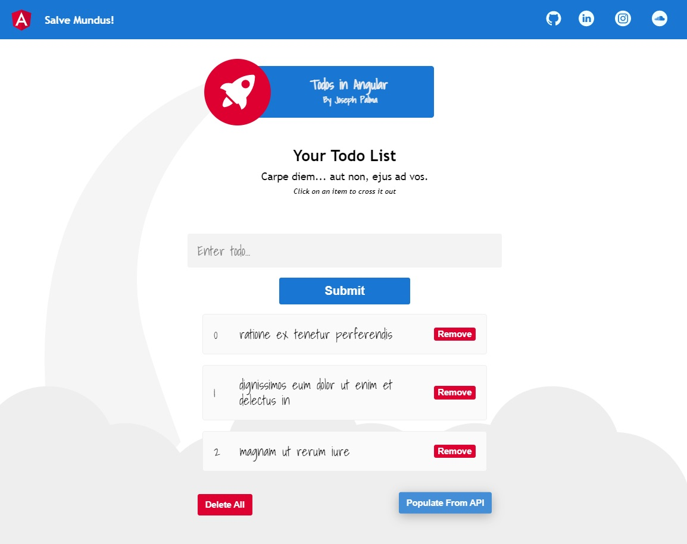

# Todos! In Angular!
#### <i>Carpe diem... aut non, ejus ad vos.</i>

Just another React developer learning the ropes of Angular. You can use this app to keep a basic list of todo items in your browser, if pen and paper doesnt suit you. This project was generated with [Angular CLI](https://github.com/angular/angular-cli) version 12.2.4.

## To Run this App Locally

Make sure you have the latest Version of Anuglar installed. Clone this repo, then cd into /todo-angular. Run `ng serve`. If all goes well you will see the app running on `http://localhost:4200/`.

## Demo
Enter your todo list, then click on items to cross them out.
</img>

Delete all items, or populate your todo list with random items from a random API.
</img>
